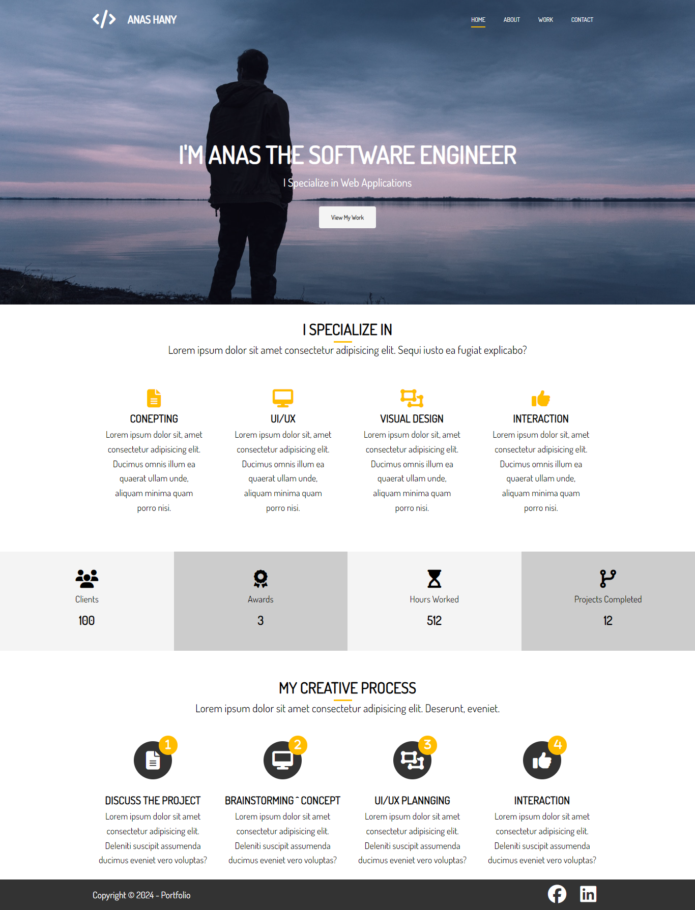

# 🌟 Welcome to Portfolio System 🌟

> Portfolio is your gateway to showcase your work and skills.

## 📋 Table of Contents

- [📝 General Info](#general-info)
- [🌐 Live Site](#live-site)
- [🖼️ Screenshots](#screenshots)
- [💻 Technologies](#technologies)
- [🚀 Setup](#setup)
- [🚦 Status](#status)
- [🎨 Inspiration](#inspiration)
- [📝 Developing Notes](#developing-notes)
- [📞 Contact](#contact)

## 📝 General Info

Portfolio features four main pages: Home, About, Work, and Contact, designed to showcase your projects and skills effectively.

## 🌐 Live Site

Explore the Portfolio live at [Portfolio Website](https://portfolio-website-system.netlify.app/).

## 🖼️ Screenshots

## 💻 Technologies

- HTML/CSS 3
- Transition
- Transform

## 🚀 Setup

No additional setup required. Visit the live site to view the Portfolio.

## 🚦 Status

The project is _complete_.

## 🎨 Inspiration

Credits to Brad Traversy for inspiring this project through his course: "Modern HTML & CSS From The Beginning (Including Sass)".

## 📝 Developing Notes

- Creation Time: Feb 24, 2024
- Project Total Time: 8 Hours 

## 📞 Contact

Connect with me on [Facebook](https://www.facebook.com/anashany219) for any inquiries or collaborations!
